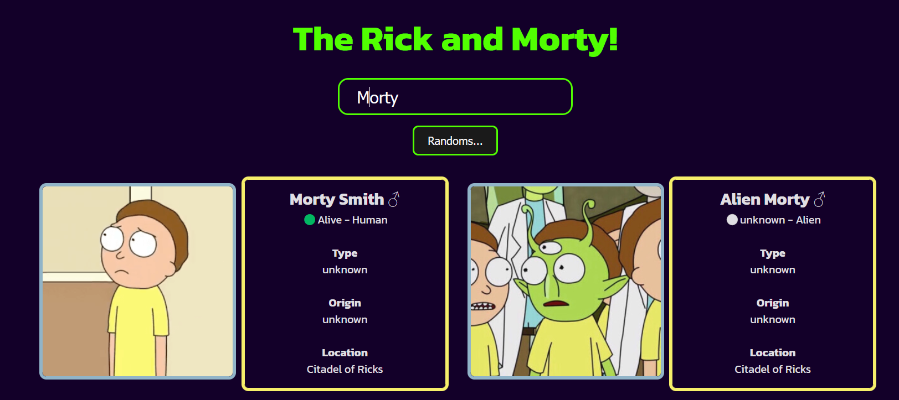

# The Rick and Morty

I'm comsuming api with JavaScript, I'm adding design with CSS and a little HTML.

> Project

### Made with 🔨

### Project view

<!-- <a href="https://pixe-l.github.io/Kitchen-Css-Grid/">Take a look at the page.</a> -->

Project made thanks to practicing in my free time, I still need to customize it but I will update it.

